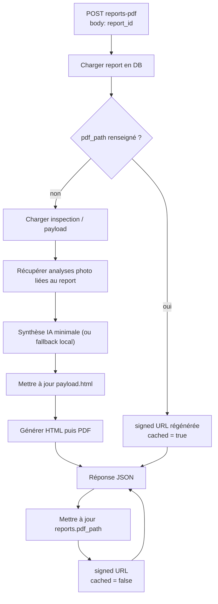

# Pipeline rapport PDF (`reports-pdf`)

Documentation interne — évite la dérive entre app Next, Edge Function Supabase et schéma `reports`.

## Décision figée

- **Source de vérité pour l’appel** : `report_id` (UUID d’une ligne `public.reports` existante).
- L’**inspection** est un contexte métier porté par le rapport, pas l’inverse pour ce contrat.
- Le code serveur d’appel vit dans `lib/triggerInspectionUltimate.ts` (`invokeReportsPdf`).

## Edge Function

- **Slug par défaut** : `reports-pdf` (surchargeable via `REPORTS_PDF_SLUG` côté déploiement / env).
- **Endpoint** : `POST /functions/v1/{slug}` sur l’URL projet Supabase.

### Corps attendu

```json
{
  "report_id": "uuid"
}
```

### Sécurité (repo)

- Appels **uniquement côté serveur** (Route Handler, Server Action, job).
- **Obligatoire** : `SUPABASE_SERVICE_ROLE_KEY` — pas de repli sur la clé anon.
- La fonction Edge peut avoir `verify_jwt` désactivé si seul le backend appelle avec la service role ; dans tous les cas, **ne pas exposer** cette URL comme API publique sans autre garde-fou.

## Réponse cible (contrat logique)

```json
{
  "success": true,
  "report_id": "uuid",
  "signed_url": "https://...",
  "expires_in": 60,
  "cached": true
}
```

Si **`REPORTS_PDF_LEDGER=true`** sur l’Edge (et migration ledger appliquée), une génération fraîche peut inclure : `"ledger": { "ok": true, "event_id": "uuid" }` ou `"ledger": { "ok": false, "error": "..." }` (le PDF est quand même livré ; surveiller les échecs ledger).

**Nuance importante — `cached`**

- `cached: true` lorsque le PDF est déjà en base **au sens** : une `pdf_path` (ou équivalent) existe déjà et on ne régénère pas le fichier.
- **Même dans ce cas**, la réponse peut inclure une **nouvelle signed URL** : l’accès temporaire est **régénéré à chaque appel**. On ne persiste **pas** une signed URL comme vérité durable ; seul le fichier dans le storage privé + la ligne `reports` font foi.

## Sous-flux IA minimal (Edge)

Sur génération fraîche (`cached: false`), `reports-pdf` peut enrichir `payload.html` avec un bloc "Rapport IA minimal".

- **Source photo prioritaire** : `reports.photo_id`.
- **Fallback 1** : `jobs.photo_id` via `reports.job_id`.
- **Fallback 2** : photos de la même inspection via `reports.inspection_id`.
- **Entrée IA** : `photos.analysis` (pas d’analyse image binaire à ce stade).
- **Sortie attendue** : JSON structuré `{ summary, critical_points[], recommendations[] }`.

Variables d’environnement optionnelles :

- `REPORTS_AI_API_KEY` (ou fallback `OPENAI_API_KEY`)
- `REPORTS_AI_MODEL` (défaut `gpt-4o-mini`)
- `REPORTS_AI_ENDPOINT` (défaut API Chat Completions OpenAI)

Mode dégradé :

- Si l’appel IA échoue (timeout, réponse invalide, clé absente), la fonction bascule sur une synthèse locale minimaliste.
- Ce sous-flux est **non bloquant** : la génération PDF continue si `payload.html` reste valide.

## Flux de génération (vue métier)



**À retenir** : si `pdf_path` existe → retour du PDF **via signed URL** ; **aucune** URL publique persistante ne doit remplacer ce modèle.

## Storage

- Bucket **privé** (pas d’accès public anonyme au fichier).
- Nom d’objet stable recommandé (ex. dérivé de `report_id`) pour idempotence et overwrite contrôlé côté Edge.

## API Next : régénérer une signed URL (viewer)

Les URLs Storage sont **temporaires**. Si l’utilisateur reste longtemps sur `/report/[id]?token=...`, le lien peut expirer.

- **Route** : `POST /api/regenerate-signed-url`
- **Corps JSON** : `{ "reportId": "<uuid>", "token": "<access_token du lien viewer>" }` (même jeton que le query `token`).
- **Réponse** : `{ "success": true, "pdf_signed_url": "https://...", "expires_in_seconds": 3600 }`
- **Sécurité** : le serveur vérifie `access_token` + `token_expires_at` comme la page viewer ; pas d’exposition de la service role au client.

Implémentation : `app/api/regenerate-signed-url/route.ts`, logique partagée `lib/rapportsPdfStorage.ts`, bouton « Rafraîchir le lien PDF » dans `components/ReportPdfRedirect.tsx`.

## Code versionné dans le repo

- `supabase/functions/reports-pdf/index.ts` — à déployer avec `supabase functions deploy reports-pdf`.
- Cache : signed URL basée sur **`reports.pdf_path`** lorsqu’il est présent (alignement DB ↔ Storage).

## Alignement code app

| Élément | Détail |
|--------|--------|
| Appel | `invokeReportsPdf(reportId)` |
| Body | `{ "report_id": "<uuid>" }` |
| Env | `NEXT_PUBLIC_SUPABASE_URL`, `SUPABASE_SERVICE_ROLE_KEY`, optionnel `REPORTS_PDF_SLUG` |
| Edge | `PDF_API_KEY` (html2pdf.app), RPC `claim_report_lock` / `release_report_lock` |
| Viewer / refresh | `POST /api/regenerate-signed-url` — même anon côté client ; service role uniquement dans le Route Handler |

## Checklist non-régression

- `cached: true` : aucun appel IA, retour signed URL immédiat.
- `cached: false` + photos avec `analysis` : enrichissement `payload.html` puis génération PDF.
- `cached: false` + IA indisponible : fallback local, pas d’échec dur si HTML final valide.
- `cached: false` + aucune source photo + HTML invalide : erreur explicite `Invalid HTML payload`.
- Verrous SQL (`claim_report_lock` / `release_report_lock`) toujours respectés.
